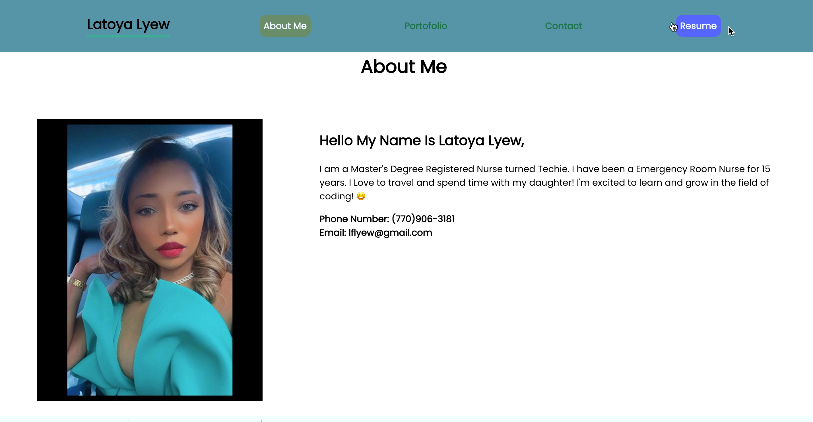

# REACT-Portfolio

## description

This is Professional Portfolio created with REACT. It contains an About Me, Portfolio, Contact and Resume page.  Links for repos and projects have been linked.  It also includes a link to resume and means of connecting in the footer. 

  ## Table of Contents 
  - [Installation](#installation)
  - [Usage](#usage)
  - [Deployment](#deployment)
  - [Test](#test)
  - [Technologies](#technologies)
  - [License](#license)

## Installation:

npm install

## Usage:

## Deployment:

 Here is the deployment link of application on heroku. 
  <a href="https://lflyew.github.io/REACT-Portfolio/"> Live Application </a>

## Test:
  There are no test for this application.
  
  
## Technologies:
  - REACT
  - Express
  - NodeJS

 
  ## License:
  License used for this project - Apache License 2.0  
  For more information on license types, please reference this website.  
  <a href="LICENSE"> Apache-2.0 </a>

  ## Repository Link

https://github.com/lflyew/REACT-Portfolio
